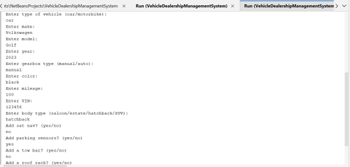

# Vehicle Dealership Management System Report

<strong>Overview</strong> 
A system is needed to assist with the record keeping of vehicles for sale in a vehicle dealership. The vehicle types available for sale at this dealership are motorbikes and cars. The available cars come in four body types and could either be a saloon, estate, hatchback, or SUV. 

Each vehicle has a make, a model, a year of manufacture (e.g., Volkswagen Golf, 2021), a gearbox type (manual or auto), a colour, mileage, and a VIN (vehicle identification number). These must be specified when the record of a vehicle is being created. Except for mileage and colour, none of the above-mentioned details may be changed after a vehicle record is created. 

As options, all cars could have a sat nav, parking sensors, a tow bar and a roof rack fitted but these options are not available for motorbikes. Motorbikes could have a luggage box fitted (not available for cars). SUVs could be fitted with all-wheel drivetrain and estates could be fitted with a third-row seat. The options for cars may only be added but not removed, however, those for motorbikes may be added or removed at any time.

<strong>Structure</strong> 
For the structure of the system, I decided on a Main class for the code to be executed, an abstract Vehicle class for base definition of vehicles and 4 derived classes Car, Motorcycle, SUV, Estate to provide additional behaviours and specific attributes to the relative class.

<strong>Main Class</strong> 

*	Vehicle Array: The vehicles array stores vehicle objects. Being static, it's shared across all instances of the class which is suitable for a system managing a set of vehicles.
*	Vehicle Count: Tracks the number of vehicles in the array in order to control array resizing.
*	Main Method: Acts as the entry point for the system. Uses a loop for continuous user interaction until an exit condition is met. Prompts and handles user input, Utilizes inbuilt Scanner class.
*	Switch Case: Handles user actions (add, update, exit).
*	Add/Update Vehicle: Method to facilitate adding or updating vehicles. They use specific prompts and validation to ensure correct data entry.
*	Resize Array: Doubles the array size to accommodate more vehicles and offer scalability to the system.
*	Print Vehicles: Iterates over the vehicle array to display current vehicles objects.
*	addCarOptions: This method can be called whenever a car's optional features need to be updated.
*	getYesNoInput: This method provides a standardized way to obtain a yes or no response from the user.
*	getValidInput: This method is used to obtain user input that matches one of the pre-defined valid options. This method ensures that the input is restricted to expected values.

Entry point for the system providing 3 options:

An error message and request to reselect is displayed if something other than those 3 options is input:

The addVehicle methods purpose is to attain details of the vehicle which is to be added to the array: 

The updateVehicle method is used to update the color (colour) or mileage of vehicles already contained in the array by using the respective vin numbers of the vehicle: 

 

Methods getValidInput and getYesNoInput displays an error message when the available option is not selected and allows the user to input again:

 

The array is doubled when the capacity of 10 vehicle objects is reached and a confirmation message is displayed. Upon exiting the system the Print method displays all the vehicle objects contained in the expanded array: 

 

Each step and option of the system was tested to ensure it operates as intended.

The UML diagram for the Main class is below:

 

<strong>Vehicle Class</strong>

*	Abstract Class: Establishes a generic blueprint for all vehicle types. Abstractness implies it's not meant to be instantiated, only extended.
*	Basic Attributes: Includes essential vehicle properties like make, model, year, etc. These are common to all vehicles, justifying their placement in the base class.
*	Final Fields: Make, model, year, gearbox type, and VIN are final, indicating they shouldn't change post-initialization, reflecting real-world immutability of these properties.
*	Setters for Mutable Fields: Color and Mileage allow modification of mutable attributes.
*	ToString Method: Overridden to provide a formatted string representation of the vehicle. Also useful for debugging.

The UML diagram for the Vehicle class is below:

 

Car Class

*	Inheritance: The Car class inherits the fundamental properties of the base vehicle class.
*	Body Type: Differentiates cars from other vehicle types and among themselves, reflecting real-world differences within car types.
*	Boolean Features: These fields align with the real-world scenario where cars have options that can be either present or not, thus a boolean is the most straightforward representation.
*	Feature Addition Methods: Explicit methods to add each feature mean that features can be retrofitted, which is often the case in vehicle customization.
*	ToString Method: Extending the base toString method allows the Car class to include additional detail specific to cars without losing the information provided by the Vehicle superclass's method.

The UML diagram for the Car class is below:
 

<strong>Motorbike Class</strong>

*	Inheritance: By extending Vehicle, Motorbike naturally acquires it’s core attributes.
*	Luggage Box Feature: As an option not common to all vehicles, it's appropriately encapsulated within the Motorbike class.
*	Boolean for Luggage Box: Reflects the optional nature of a luggage box on a motorbike, allowing for simple addition or removal.
*	Add/Remove Luggage Box Methods: These methods provide the ability to modify the motorbike's customization, which is a realistic requirement for motorbike owners.
*	ToString Method: A specific override to include motorbike-relevant information.

The UML diagram for the Motorbike class is below:

<strong>SUV Class</strong>

*	Subclass of Car: Inherits from Car, leveraging already defined car attributes and extending functionality specific to SUVs.
*	All-Wheel Drive Feature: Option available due to the fact that not all SUVs may have it therefore offering flexibility.
*	Boolean for All-Wheel Drive: An optional feature that can be selected, mirroring the actual choice available to SUV buyers.
*	Method to Add All-Wheel Drive: Provides a clear and explicit way to add this feature, which could affect other aspects of the vehicle's behaviour, such as pricing or performance.
*	ToString Method: Provides accurate description of the vehicle's current configuration, especially for a specialized subclass like SUV.

The UML diagram for the UML class is below:

 

<strong>Estate Class</strong>

*	Subclass of Car: This follows the logical hierarchy of vehicle types, where an estate is a certain type of car, inheriting common car features and adding specific ones.
*	Third Row Seat Feature: The decision to treat the third-row seat as a distinct feature reflects the variability in estate car configurations.
*	Boolean for Third Row Seat: This encapsulates the binary nature of this feature, providing a clear indication of whether the estate car has this feature or not.
*	Method to Add Third Row Seat: Allowing the addition of this feature aligns with real-world scenarios where car configurations are modified post-purchase.
*	ToString Method: Overriding this method ensures that any string representation of the Estate car includes all relevant information, including the specific feature of a third-row seat.

The UML diagram for the Estate class is below:

   

<strong>Summary</strong>

Each class's design and structure are a testament to the practical application of object-oriented design principles, such as encapsulation, inheritance, and polymorphism, ensuring that the system is scalable, maintainable, and reflective of real-world entities and behaviours.

<strong>Technologies and Credits</strong>

*	Apache NetBeans IDE 19 – platform used to write and develop programmes 
*	GitHub – platform used for version control 
*	[Stack Overflow](https://stackoverflow.com/) - online programming and developer community 
*	[Dundee University](https://www.dundee.ac.uk/) - institution of higher education
